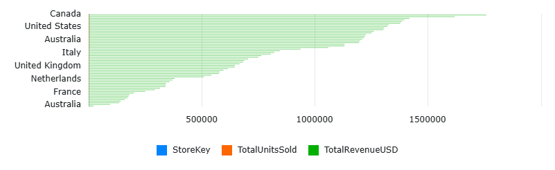
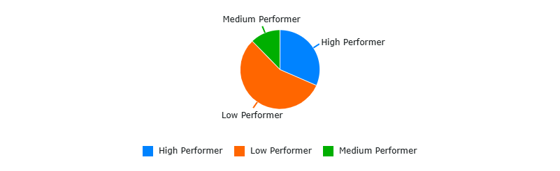

# Global Electronics Retailer - Sales and Revenue Trends

## CAP2761C Final Project | Miami Dade College

**Team Members:** Daniel Cedeno, Yisel Alvarado, Jose Alfaro

**Database:** GlobalElectronicsDB2026 (Azure SQL)

**Source:** [Maven Analytics - Global Electronics Retailer](https://mavenanalytics.io/data-playground/global-electronics-retailer)

---

## Goal 2: Evaluate Store Performance
**Author: Daniel Cedeno**

### Questions Explored
1. What are the total sales for each store?
2. How do stores rank against each other by total revenue?
3. Does store size in square meters influence total sales revenue?
4. How many stores fall into each performance category (High, Medium, or Low Performer)?

### Key Findings
- **Store #9** (Canada - Northwest Territories) generates the highest revenue at **$1,756,645**
- **Wyoming** is the most efficient store with only 840 sq meters but ranks #14 in total revenue
- **18 stores** are High Performers, **7** are Medium Performers, and **32** are Low Performers
- Canadian and US stores dominate the top rankings while European stores tend to underperform

### Visualizations

#### Total Sales by Store

#### Store Performance Classification

### T-SQL Queries
See [Goal2_Queries.sql](Goal2_Queries.sql) for the full query file.

---
